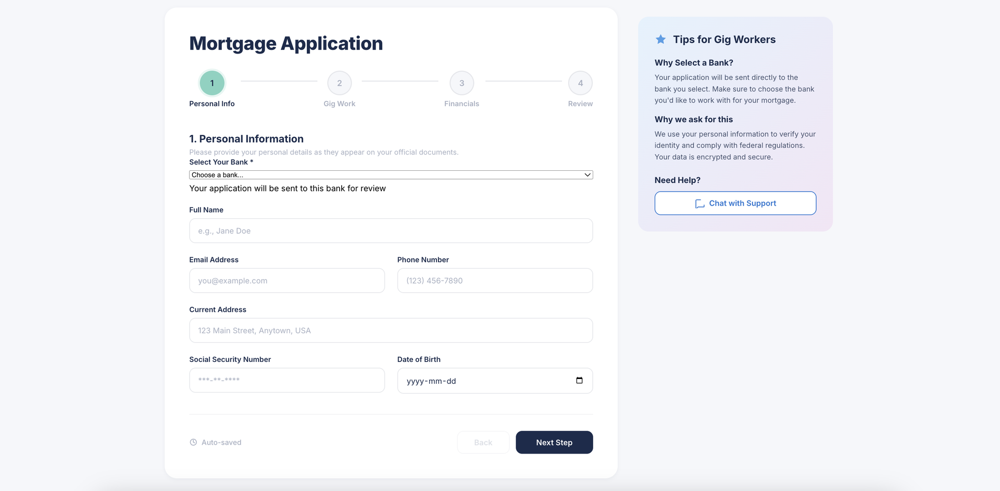
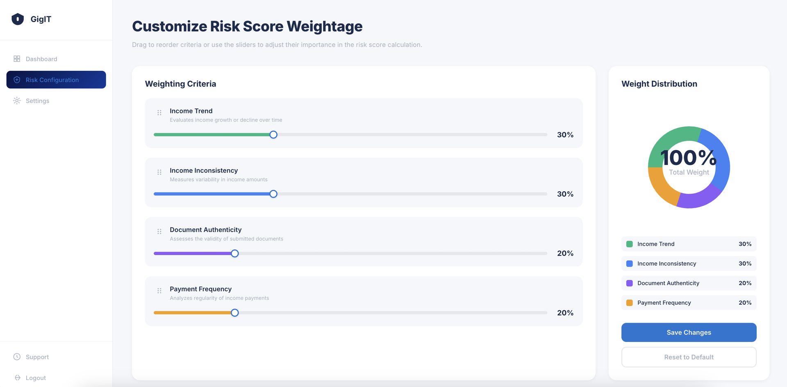

# 🏦 GigIT

<div align="center">


### 💼 *Fast-track freelancer verification with AI-powered document analysis* 🚀

**Reducing freelancer bank approval from days to hours using generative AI**

[🏆 First Place - NewHacks 2025](#) • [📖 Documentation](#features) • [🐛 Report Bug](https://github.com/yourusername/gigit/issues)

</div>

---

## 📸 Screenshots

<div align="center">

### 🏠 Landing Page


### 🔐 Bank Login


### 📄 Application Interface


### ⚠️ Risk Configuration


</div>

---

## 💡 The Problem

Freelancers face **major delays** getting verified by banks because:
- ❌ Manual review of tax documents takes **days or weeks**
- ❌ Traditional verification systems don't support 1099 forms well
- ❌ Underwriters are overwhelmed with document processing
- ❌ Freelancers lose opportunities while waiting for approval

**GigIT solves this** by automating the verification process with AI.

---

## ✨ What GigIT Does

<div align="center">


</div>

### 🎯 Key Features

- 📤 **Document Upload** - Submit tax forms (1099, W-2, etc.) via API
- 🤖 **AI-Powered Analysis** - Gemini 2.5 Pro extracts and validates data
- ⚡ **Instant Reports** - Generate verification reports in seconds
- 🔍 **Underwriter Review** - Human-in-the-loop for final approval
- ⏱️ **Time Savings** - Reduce verification from **days to hours**
- 🔒 **Secure Processing** - Bank-grade document handling
- 📊 **Risk Scoring** - Automated risk assessment based on income patterns

---

## 🛠️ Tech Stack

### Backend


### AI/ML


### Frontend


---

## 🚀 Quick Start

### Prerequisites
```bash
# Python 3.11+
python --version

# Node.js 18+ (for frontend)
node --version
```

### Installation

1️⃣ **Clone the repository**
```bash
git clone https://github.com/yourusername/gigit.git
cd gigit
```

2️⃣ **Backend Setup**
```bash
cd backend
python -m venv venv
source venv/bin/activate  # On Windows: venv\Scripts\activate
pip install -r requirements.txt
```

3️⃣ **Configure Environment**
```bash
# Create .env file in backend/
cp .env.example .env

# Add your Gemini API key
GEMINI_API_KEY=your_api_key_here
```

4️⃣ **Run the Backend**
```bash
uvicorn main:app --reload
```

5️⃣ **Frontend Setup** (Optional)
```bash
cd ../frontend
npm install
npm run dev
```

---

## 📡 API Documentation

### Upload Document for Verification

**POST** `/verify`
```bash
curl -X POST "http://localhost:8000/verify" \
  -F "file=@/path/to/1099.pdf" \
  -F "user_id=12345"
```

**Response:**
```json
{
  "status": "success",
  "verification_id": "v_abc123",
  "report": {
    "freelancer_name": "John Doe",
    "total_income": "$75,000",
    "tax_year": "2024",
    "risk_score": "LOW",
    "verification_status": "PENDING_REVIEW",
    "extracted_data": {
      "ein": "XX-XXXXXXX",
      "income_breakdown": {...}
    }
  }
}
```

### Get Verification Status

**GET** `/verify/{verification_id}`

curl "http://localhost:8000/verify/v_abc123"
```

---

## 🎨 Project Structure
```
gigit/
├── backend/
│   ├── main.py              # FastAPI application
│   ├── ai_processor.py      # Gemini AI integration
│   ├── document_parser.py   # PDF/image processing
│   ├── requirements.txt     # Python dependencies
│   └── .env                 # Environment variables
│
├── frontend/
│   ├── src/
│   │   ├── components/      # React components
│   │   ├── pages/           # Page components
│   │   └── App.jsx          # Main app
│   └── package.json
│
├── Mock Dataset/            # Test 1099 forms
├── screenshots/             # UI screenshots
└── README.md
```

---

## 🏆 Hackathon Achievement

<div align="center">

### 🥇 First Place - NewHacks 2025

Built in **24 hours** at University of Toronto's premier hackathon

**Team:** Jemima Silaen, Vriti Dahiya, Sansita Malhotra

</div>

---

## 🎯 What We Learned

### Technical Growth
- 🤖 **AI Integration** - First time working with Gemini 2.5 Pro's generative AI
- 📄 **Document Processing** - Learned to handle various PDF formats and scanned images
- ⚡ **FastAPI** - Built production-ready REST APIs with async processing
- 🔐 **Security** - Implemented secure file handling for sensitive documents

### Product Insights
- 💼 **Understanding User Needs** - Freelancers need faster, more accessible banking
- 🏦 **Industry Knowledge** - Learned about KYC (Know Your Customer) processes
- 🎨 **UX Design** - Created intuitive interfaces for both freelancers and banks

---

## 🚧 Challenges We Overcame

| Challenge | Solution |
|-----------|----------|
| 📄 **Varying PDF Formats** | Built robust parser supporting multiple 1099 variations |
| 🤖 **AI Accuracy** | Fine-tuned prompts and implemented validation checks |
| ⏱️ **Processing Speed** | Optimized AI calls and implemented caching |
| 🔒 **Data Security** | Implemented temporary file storage with auto-deletion |

---

## 🔮 Future Roadmap

### Phase 1: Enhanced Features
- [ ] 🌍 **International Forms** - Support for global tax documents
- [ ] 📊 **Analytics Dashboard** - Track verification trends and patterns
- [ ] 🔔 **Real-time Notifications** - Alert freelancers on status updates
- [ ] 🔐 **Authentication System** - OAuth2 for secure user access

### Phase 2: AI Improvements
- [ ] 🎯 **Multi-Model Support** - Add fallback AI models for redundancy
- [ ] 📈 **Confidence Scoring** - Show AI confidence in extracted data
- [ ] 🔍 **Fraud Detection** - Identify potential document tampering
- [ ] 💬 **Natural Language Queries** - Ask questions about documents

### Phase 3: Scale & Integration
- [ ] ☁️ **Cloud Deployment** - AWS/GCP production deployment
- [ ] 🏦 **Bank API Integration** - Direct integration with banking systems
- [ ] 📱 **Mobile App** - iOS/Android apps for freelancers
- [ ] 🌐 **Multi-tenant SaaS** - Support multiple banks on one platform

---

## 📄 License

**View-Only Repository**

All rights reserved by **Jemima Silaen**, **Vriti Dahiya**, and **Sansita Malhotra**.

No copying, redistribution, or derivative works are permitted without prior written consent. See [LICENSE](LICENSE) for details.

---

## 👥 Team

<div align="center">

| [Jemima Silaen](https://github.com/jemima) | [Vriti Dahiya](https://github.com/vriti) | [Sansita Malhotra](https://github.com/sansita) |
|:---:|:---:|:---:|
| Backend & AI | Frontend & UX | Full Stack |

</div>


<div align="center">

**Built with ❤️ at NewHacks 2025**

⭐ Star us on GitHub if you found this project interesting!

[](https://github.com/yourusername/gigit)
[](https://github.com/yourusername/gigit/fork)

</div>
